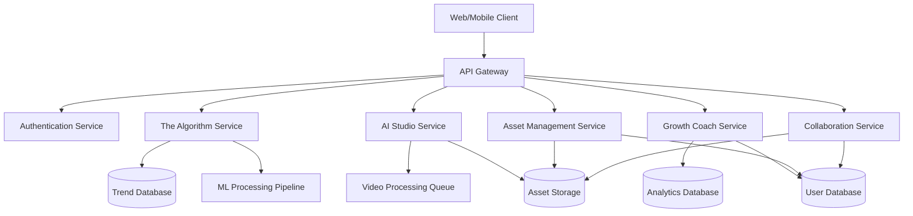

# Design Document: VeloCity

## Overview

VeloCity is an AI-powered content production suite architected as a modular system with three primary components: The Algorithm (trend prediction), AI Studio (neural video editing), and Growth Coach (analytics and recommendations). The system follows a microservices architecture with a unified API gateway, enabling independent scaling and development of each component while maintaining a cohesive user experience.

The platform targets Gen-Z creators who need to produce high-quality content quickly while staying ahead of trends. The design emphasizes real-time processing, intuitive workflows, and data-driven insights to maximize creator productivity and content performance.

## Architecture

### High-Level Architecture



### Service Responsibilities

**API Gateway**: Routes requests, handles rate limiting, and provides unified authentication

**The Algorithm Service**: Ingests social media data, runs trend prediction models, and serves trend recommendations

**AI Studio Service**: Manages video editing operations, coordinates with ML pipeline for neural edits, and handles export operations

**Growth Coach Service**: Aggregates analytics data, generates performance reports, and provides personalized recommendations

**Asset Management Service**: Handles file uploads, storage, organization, and retrieval

**Collaboration Service**: Manages project sharing, permissions, and real-time collaboration features

## Components and Interfaces

### The Algorithm Component

**Purpose**: Predict and surface emerging trends for content creators

**Core Interfaces**:

```typescript
interface TrendPredictionEngine {
  analyzeSocialData(timeWindow: TimeWindow): Promise<Trend[]>
  calculateTrendScore(trend: Trend): number
  predictTrendTrajectory(trend: Trend): TrendTrajectory
  filterByNiche(trends: Trend[], niche: string): Trend[]
  rankTrends(trends: Trend[]): Trend[]
}

interface Trend {
  id: string
  topic: string
  score: number  // 0-100
  trajectory: 'rising' | 'peaking' | 'declining'
  niche: string[]
  predictedPeakTime: Date
  relevanceScore: number
  metadata: TrendMetadata
}

interface TrendMetadata {
  sources: string[]
  firstDetected: Date
  engagementVelocity: number
  relatedTopics: string[]
}
```

**Key Operations**:
- Ingest social media data from multiple platforms via APIs
- Run ML models to identify emerging patterns
- Calculate virality scores using engagement velocity and growth rate
- Predict trend lifecycle (rise, peak, decline phases)
- Filter and rank trends based on user preferences

### AI Studio Component

**Purpose**: Provide neural video editing capabilities with intuitive controls

**Core Interfaces**:

```typescript
interface VideoEditor {
  uploadAsset(file: File, metadata: AssetMetadata): Promise<Asset>
  applyNeuralEdit(assetId: string, operation: NeuralEditOperation): Promise<EditJob>
  getEditStatus(jobId: string): Promise<JobStatus>
  previewEdit(jobId: string): Promise<PreviewURL>
  exportContent(assetId: string, format: ExportFormat): Promise<ExportJob>
}

interface NeuralEditOperation {
  type: 'style_transfer' | 'background_removal' | 'caption_generation' | 'audio_enhancement' | 'auto_enhance'
  parameters: Record<string, any>
  targetFrames?: FrameRange
}

interface Asset {
  id: string
  userId: string
  filename: string
  format: string
  size: number
  duration?: number
  uploadDate: Date
  metadata: AssetMetadata
  versions: AssetVersion[]
}

interface ExportFormat {
  container: 'mp4' | 'mov' | 'webm'
  resolution: '720p' | '1080p' | '4k'
  platform?: 'youtube' | 'tiktok' | 'instagram' | 'twitter'
  aspectRatio?: string
}
```

**Key Operations**:
- Process video uploads with format validation
- Queue neural edit operations for async processing
- Apply ML models for style transfer, object detection/removal
- Generate captions using speech-to-text models
- Export videos with platform-specific optimizations

### Growth Coach Component

**Purpose**: Provide analytics insights and personalized growth recommendations

**Core Interfaces**:

```typescript
interface AnalyticsEngine {
  aggregateMetrics(userId: string, period: TimePeriod): Promise<AnalyticsReport>
  calculateGrowthRate(userId: string, period: TimePeriod): Promise<number>
  identifyTopContent(userId: string, metric: MetricType, limit: number): Promise<Content[]>
  generateRecommendations(userId: string): Promise<Recommendation[]>
  trackRecommendationImpact(userId: string, recommendationId: string): Promise<ImpactReport>
}

interface AnalyticsReport {
  userId: string
  period: TimePeriod
  metrics: EngagementMetrics
  growthRate: number
  topContent: Content[]
  insights: Insight[]
  generatedAt: Date
}

interface EngagementMetrics {
  views: number
  likes: number
  shares: number
  comments: number
  engagementRate: number
  averageWatchTime?: number
}

interface Recommendation {
  id: string
  type: 'posting_time' | 'content_format' | 'topic' | 'editing_style'
  title: string
  description: string
  rationale: string
  priority: number
  expectedImpact: string
}
```

**Key Operations**:
- Aggregate engagement data from connected platforms
- Calculate growth metrics and trends
- Identify patterns in successful content
- Generate personalized recommendations using ML models
- Track recommendation effectiveness

### Asset Management Component

**Purpose**: Handle storage, organization, and retrieval of content assets

**Core Interfaces**:

```typescript
interface AssetManager {
  uploadAsset(file: File, userId: string, tags: string[]): Promise<Asset>
  searchAssets(userId: string, filters: AssetFilters): Promise<Asset[]>
  deleteAsset(assetId: string, userId: string): Promise<void>
  restoreAsset(assetId: string, userId: string): Promise<Asset>
  checkStorageQuota(userId: string): Promise<StorageInfo>
}

interface AssetFilters {
  dateRange?: DateRange
  type?: 'video' | 'image' | 'audio'
  tags?: string[]
  searchQuery?: string
}

interface StorageInfo {
  used: number  // bytes
  limit: number  // bytes
  percentUsed: number
  accountType: 'free' | 'premium'
}
```

**Key Operations**:
- Store files in cloud storage (S3-compatible)
- Index assets with metadata for fast retrieval
- Implement soft-delete with 30-day retention
- Enforce storage quotas based on account type
- Support tagging and search functionality

### Collaboration Component

**Purpose**: Enable multi-user collaboration on content projects

**Core Interfaces**:

```typescript
interface CollaborationManager {
  shareProject(projectId: string, permissions: SharePermissions): Promise<ShareLink>
  accessSharedProject(linkId: string, userId: string): Promise<Project>
  lockAsset(assetId: string, userId: string): Promise<Lock>
  releaseAsset(assetId: string, userId: string): Promise<void>
  addComment(assetId: string, comment: Comment): Promise<Comment>
  getActivityLog(projectId: string): Promise<Activity[]>
}

interface SharePermissions {
  level: 'view' | 'edit'
  expiresAt: Date
  allowComments: boolean
}

interface Lock {
  assetId: string
  userId: string
  acquiredAt: Date
  expiresAt: Date
}

interface Comment {
  id: string
  assetId: string
  userId: string
  text: string
  timestamp: number  // video timestamp in seconds
  createdAt: Date
}
```

**Key Operations**:
- Generate secure shareable links with expiration
- Manage access control and permissions
- Implement optimistic locking for concurrent edits
- Track all collaboration activities
- Support timestamped comments on video assets

## Data Models

### User Model

```typescript
interface User {
  id: string
  email: string
  passwordHash: string
  profile: UserProfile
  accountType: 'free' | 'premium'
  storageQuota: number
  createdAt: Date
  lastLogin: Date
  preferences: UserPreferences
}

interface UserProfile {
  displayName: string
  avatar?: string
  bio?: string
  socialLinks: SocialLink[]
  niche?: string[]
}

interface UserPreferences {
  defaultExportFormat: ExportFormat
  notificationSettings: NotificationSettings
  trendFilters: string[]
}
```

### Project Model

```typescript
interface Project {
  id: string
  userId: string
  name: string
  description?: string
  assets: string[]  // asset IDs
  collaborators: Collaborator[]
  createdAt: Date
  updatedAt: Date
  status: 'draft' | 'in_progress' | 'completed'
}

interface Collaborator {
  userId: string
  permissions: 'view' | 'edit'
  addedAt: Date
  addedBy: string
}
```

### Edit Job Model

```typescript
interface EditJob {
  id: string
  assetId: string
  userId: string
  operation: NeuralEditOperation
  status: 'queued' | 'processing' | 'completed' | 'failed'
  progress: number  // 0-100
  createdAt: Date
  startedAt?: Date
  completedAt?: Date
  error?: string
  resultAssetId?: string
}
```

### Analytics Event Model

```typescript
interface AnalyticsEvent {
  id: string
  userId: string
  contentId: string
  platform: string
  eventType: 'view' | 'like' | 'share' | 'comment'
  timestamp: Date
  metadata: Record<string, any>
}
```


## Correctness Properties

*A property is a characteristic or behavior that should hold true across all valid executions of a system—essentially, a formal statement about what the system should do. Properties serve as the bridge between human-readable specifications and machine-verifiable correctness guarantees.*

### Trend Prediction Properties

**Property 1: Trend identification from recent data**
*For any* valid social media dataset with known trending patterns in the past 24 hours, the trend prediction engine should identify those trends
**Validates: Requirements 1.1**

**Property 2: Trend object validity**
*For any* identified trend, the trend score must be between 0 and 100 (inclusive) and the trajectory must be one of 'rising', 'peaking', or 'declining'
**Validates: Requirements 1.2, 1.3**

**Property 3: Niche filtering correctness**
*For any* set of trends and a niche filter, all returned trends should have that niche in their niche array
**Validates: Requirements 1.4**

**Property 4: Trend ranking order**
*For any* list of trends, the ranked output should be sorted first by predicted peak time, then by relevance score in descending order
**Validates: Requirements 1.5**

### Video Editing Properties

**Property 5: Original asset preservation**
*For any* content asset and neural edit operation, applying the edit should leave the original asset unchanged and create a new asset version
**Validates: Requirements 2.3**

**Property 6: Edit queue ordering**
*For any* sequence of neural edit operations submitted to the queue, the processing order should match the submission order (FIFO)
**Validates: Requirements 2.4**

**Property 7: Edit failure state preservation**
*For any* invalid neural edit operation that fails, the system should return a descriptive error message and the asset state should remain unchanged from before the operation
**Validates: Requirements 2.5**

**Property 8: Auto-enhancement application**
*For any* content asset where auto-enhancement is enabled, the system should apply both color correction and stabilization operations
**Validates: Requirements 3.5**

### Export Properties

**Property 9: Export format support**
*For any* valid export request specifying MP4, MOV, or WEBM format and 720p, 1080p, or 4K resolution, the system should successfully generate the export
**Validates: Requirements 4.1, 4.5**

**Property 10: Platform-specific export transformations**
*For any* content exported for a specific platform (YouTube, TikTok, Instagram, Twitter), the exported file should have the aspect ratio and resolution requirements for that platform
**Validates: Requirements 4.2**

**Property 11: Export completion artifacts**
*For any* completed export job, the system should generate a notification and a download link with an expiration date 7 days in the future
**Validates: Requirements 4.4**

### Analytics Properties

**Property 12: Analytics report completeness**
*For any* analytics report generated for time periods of 7, 30, or 90 days, the report should include views, likes, shares, comments, and growth rate as a percentage
**Validates: Requirements 5.1, 5.2, 5.3**

**Property 13: Top content identification**
*For any* set of content items, the top 5 by engagement rate should be correctly identified and sorted in descending order by engagement rate
**Validates: Requirements 5.4**

**Property 14: Minimum recommendation count**
*For any* recommendation generation request, the system should return at least 3 recommendations
**Validates: Requirements 6.1**

**Property 15: Beginner recommendation targeting**
*For any* user with fewer than 10 published content pieces, all generated recommendations should be tagged as beginner-focused
**Validates: Requirements 6.2**

**Property 16: Optimal posting time identification**
*For any* user with engagement history, the system should identify and return at least one optimal posting time
**Validates: Requirements 6.3**

**Property 17: Decline-triggered improvement suggestions**
*For any* user whose content performance has declined (negative growth rate), the system should generate improvement suggestions based on their past successful content
**Validates: Requirements 6.4**

**Property 18: Recommendation impact tracking**
*For any* recommendation that a user follows, the impact should be tracked and included in the next analytics report generated after the recommendation was followed
**Validates: Requirements 6.5**

### Authentication Properties

**Property 19: Registration validation**
*For any* registration attempt with an invalid email format or password shorter than 8 characters, the system should reject the registration with an appropriate error message
**Validates: Requirements 7.1**

**Property 20: Session creation on login**
*For any* successful login with valid credentials, the system should create a session with an expiration date 30 days in the future
**Validates: Requirements 7.2**

**Property 21: Generic authentication errors**
*For any* login attempt with invalid credentials (wrong email or wrong password), the error message should not reveal which credential was incorrect
**Validates: Requirements 7.3**

**Property 22: Profile update persistence**
*For any* profile update request, the changes should be immediately persisted to the database and a success confirmation should be returned
**Validates: Requirements 7.4**

### Asset Management Properties

**Property 23: Asset metadata completeness**
*For any* uploaded content asset, the stored asset should include metadata fields for upload date, file size, and format
**Validates: Requirements 8.1**

**Property 24: Asset search filtering**
*For any* asset search with filters for date range, type, or tags, all returned assets should match all specified filter criteria
**Validates: Requirements 8.2**

**Property 25: Soft delete behavior**
*For any* deleted content asset, it should be moved to a trash folder with a deletion date, and permanent deletion should not occur until 30 days after the deletion date
**Validates: Requirements 8.3**

**Property 26: Storage quota enforcement**
*For any* account, the storage quota should be 10GB for free accounts and 100GB for premium accounts
**Validates: Requirements 8.4**

**Property 27: Upload prevention at quota**
*For any* account at or exceeding its storage quota, new upload attempts should be rejected with an error notification
**Validates: Requirements 8.5**

### Collaboration Properties

**Property 28: Share link generation**
*For any* project share request, the system should generate a unique shareable link with an expiration date 90 days in the future
**Validates: Requirements 9.1**

**Property 29: Permission-based access control**
*For any* collaborator accessing a shared project, the granted permissions (view or edit) should match the permissions specified in the share settings
**Validates: Requirements 9.2**

**Property 30: Concurrent edit conflict prevention**
*For any* content asset being edited by one collaborator, simultaneous edit attempts by other collaborators should be prevented until the first edit is complete or the lock is released
**Validates: Requirements 9.3**

**Property 31: Collaboration audit logging**
*For any* change made by a collaborator, an audit log entry should be created containing the timestamp, user ID, and action description
**Validates: Requirements 9.4**

**Property 32: Conditional comment functionality**
*For any* project where comments are enabled, collaborators should be able to add comments with timestamps to content assets
**Validates: Requirements 9.5**

### Error Handling Properties

**Property 33: Error logging and user messaging**
*For any* system error that occurs during operation, the error should be logged with full details and a user-friendly error message should be displayed to the user
**Validates: Requirements 10.3**

## Error Handling

### Error Categories

**Validation Errors**: Input validation failures (invalid formats, missing required fields, constraint violations)
- Return 400 Bad Request with specific field-level error messages
- Do not expose internal system details

**Authentication Errors**: Failed authentication or authorization
- Return 401 Unauthorized for authentication failures
- Return 403 Forbidden for authorization failures
- Use generic messages to prevent information leakage

**Resource Errors**: Missing or inaccessible resources
- Return 404 Not Found for missing resources
- Return 409 Conflict for resource conflicts (e.g., concurrent edits)

**Processing Errors**: Failures during ML operations or video processing
- Return 500 Internal Server Error for unexpected failures
- Return 503 Service Unavailable for temporary service issues
- Log full error details for debugging
- Provide job status endpoints for async operations

**Quota Errors**: Storage or rate limit exceeded
- Return 429 Too Many Requests for rate limits
- Return 413 Payload Too Large for storage quota exceeded
- Include quota information in error response

### Error Recovery Strategies

**Retry Logic**: Implement exponential backoff for transient failures in external API calls and ML processing

**Circuit Breakers**: Prevent cascading failures by temporarily disabling failing services

**Graceful Degradation**: When The Algorithm service is unavailable, serve cached trends; when AI Studio is overloaded, queue operations with estimated wait times

**Data Consistency**: Use database transactions for multi-step operations; implement idempotency keys for critical operations

**User Communication**: Provide clear error messages with actionable next steps; show progress indicators for long-running operations

## Testing Strategy

### Dual Testing Approach

VeloCity will employ both unit testing and property-based testing to ensure comprehensive correctness validation:

**Unit Tests**: Verify specific examples, edge cases, and error conditions
- Focus on integration points between components
- Test specific error scenarios and boundary conditions
- Validate platform-specific export configurations
- Test authentication flows and session management

**Property-Based Tests**: Verify universal properties across all inputs
- Use property-based testing to validate the 33 correctness properties defined above
- Generate randomized test data to explore the input space
- Each property test should run a minimum of 100 iterations
- Tag each test with: **Feature: velocity, Property {number}: {property_text}**

### Property-Based Testing Configuration

**Testing Library**: Use `fast-check` for TypeScript/JavaScript components

**Test Structure**: Each correctness property maps to exactly one property-based test

**Tagging Convention**: 
```typescript
// Feature: velocity, Property 5: Original asset preservation
test('applying neural edit preserves original asset', () => {
  fc.assert(
    fc.property(
      assetArbitrary,
      editOperationArbitrary,
      (asset, operation) => {
        const originalAsset = cloneDeep(asset);
        const result = applyNeuralEdit(asset, operation);
        expect(asset).toEqual(originalAsset);
        expect(result.versions.length).toBeGreaterThan(asset.versions.length);
      }
    ),
    { numRuns: 100 }
  );
});
```

**Generator Strategy**: Create arbitraries (generators) for:
- Trends with various scores, trajectories, and niches
- Content assets with different formats and sizes
- Neural edit operations with valid and invalid parameters
- User profiles with different account types and content counts
- Analytics data with various engagement patterns
- Share permissions and collaboration scenarios

### Integration Testing

**API Integration Tests**: Test end-to-end flows through the API gateway
- User registration → content upload → edit → export flow
- Trend discovery → content creation → analytics review flow
- Project sharing → collaboration → comment flow

**Service Integration Tests**: Test interactions between services
- The Algorithm service providing trends to Growth Coach for recommendations
- AI Studio coordinating with Asset Management for file storage
- Collaboration service enforcing locks during concurrent edits

**External Integration Tests**: Test integrations with external services
- Social media API data ingestion for trend prediction
- OAuth provider authentication flows
- Cloud storage operations (S3-compatible)

### Performance Testing

While not part of unit/property tests, performance benchmarks should be established for:
- Video processing throughput (assets per minute)
- Trend prediction latency (time to analyze and rank trends)
- Analytics aggregation speed (time to generate reports)
- Concurrent user capacity (simultaneous active users)

### Test Coverage Goals

- Minimum 80% code coverage for all services
- 100% coverage of correctness properties through property-based tests
- All error handling paths tested with unit tests
- All API endpoints tested with integration tests
